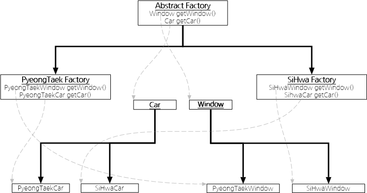

# Abstract Factory Pattern (추상 팩토리 패턴)
## 개요
Factory Pattern 과 비슷하지만, Factory 가 인터페이스를 사용하는 패턴입니다.

다양한 구성 요소 별로 '객체의 집합'을 생성해야 할 때 유용합니다. <br />
이 패턴을 사용하여 상황에 알맞은 객체를 생성할 수 있습니다.

예를 들면 OS 별로 Factory 에서 생성되 나오는 인스턴스가 각각 달라야 하는 경우에 사용할 수 있을 것입니다.

## UML 다이어그램


## 예제 코드
### AbstractFactory
```java
public interface AbstractFactory {
    public Window getWindow();
    public Car getCar();
}
```

### PyeongTaekFactory
```java
public class PyeongTaekFactory {
    public PyeongTaekWindow getWindow() {
        return new PyeongTaekWindow();
    }
    public PyeongTaekCar getCar() {
        return new PyeongTaekCar();
    }
}
```

### SiHwaFactory
```java
public class SiHwaFactory {
    public SiHwaWindow getWindow() {
        return new SiHwaWindow();
    }
    public SiHwaCar getCar() {
        return new SiHwaCar();
    }
}
```

### Car
```java
public interface Car {
    public void move();
    public void stop();
}
```

## PyeongTaekCar
```java
public class PyeongTaekCar {
    public void move() {
        System.out.println("PyeongTaekCar move");
    }
    public void stop() {
        System.out.println("PyeongTaekCar stop");
    }
}
```

## SiHwaCar
```java
public class SiHwaCar {
    public void move() {
        System.out.println("SiHwaCar move");
    }
    public void stop() {
        System.out.println("SiHwaCar stop");
    }
}
```

### Window
```java
public interface Window {
    public void open();
    public void close();
}
```

## PyeongTaekWindow
```java
public class PyeongTaekWindow {
    public void open() {
        System.out.println("PyeongTaekWindow open");
    }
    public void close() {
        System.out.println("PyeongTaekWindow close");
    }
}
```

## SiHwaWindow
```java
public class SiHwaWindow {
    public void open() {
        System.out.println("SiHwaWindow open");
    }
    public void close() {
        System.out.println("SiHwaWindow close");
    }
}
```

## Main
```java
public class Main {
    public static void main(String[] args) {
        AbstractFactory pfactory = new PyeongTaekFactory();
        AbstractFactory sfactory = new SiHwaFactory();

        Car pcar = pfactory.getCar();
        Car scar = sfactory.getCar();

        pcar.move();
        pcar.stop();

        scar.move();
        scar.stop();

        Window pwindow = pfactory.getWindow();
        Window swindow = sfactory.getWindow();

        pwindow.open();
        pwindow.close();

        swindow.open();
        swindow.close();
    }
}
```

## Output
```
PyeongTaekCar move
PyeongTaekCar stop
SiHwaCar move
SiHwaCar stop
PyeongTaekWindow open
PyeongTaekWindow close
SiHwaWindow open
SiHwaWindow close
```

# 참고
[위키피디아](https://ko.wikipedia.org/wiki/%EC%B6%94%EC%83%81_%ED%8C%A9%ED%86%A0%EB%A6%AC_%ED%8C%A8%ED%84%B4)